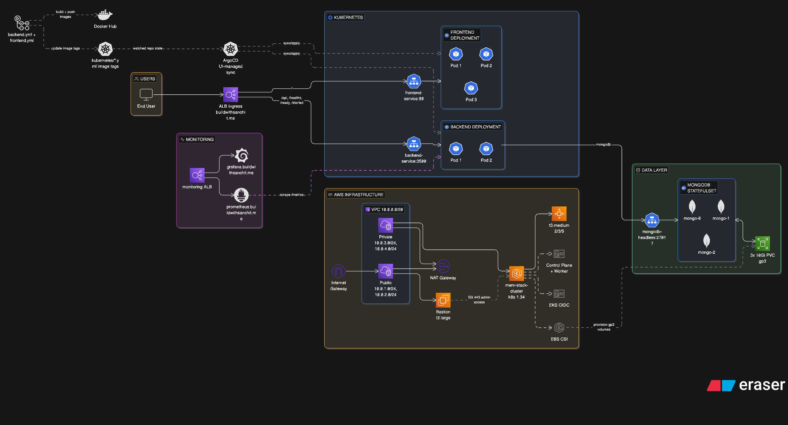

# MERN Stack DevOps

A production-style MERN task manager deployed on AWS EKS with Terraform, Kubernetes, GitHub Actions, and ArgoCD (UI-managed sync).

## Architecture Diagram



## High-Level Flow

1. User traffic enters via ALB Ingress (`buildwithsanchit.me`).
2. Ingress routes `/` to `frontend-service:80` and `/api` + health routes to `backend-service:3500`.
3. Backend (Express + Mongoose) serves task APIs and connects to MongoDB replica set via `mongodb-headless`.
4. MongoDB runs as a 3-replica StatefulSet with `gp3` persistent storage.
5. GitHub Actions builds/scans/pushes images and updates Kubernetes image tags in repo manifests.
6. ArgoCD (configured through UI) syncs manifest changes to EKS workloads.

## Stack

- Frontend: React 17, Material-UI, Axios, Nginx container
- Backend: Node.js, Express, Mongoose, Prometheus metrics (`/metrics`)
- Data: MongoDB 4.4.6 StatefulSet (3 replicas)
- Orchestration: Kubernetes on EKS (`mern-stack` namespace)
- Infrastructure: Terraform (AWS provider `~> 6.28.0`, region `ap-south-1`)
- CI/CD + GitOps: GitHub Actions + ArgoCD

## Core Endpoints

- API: `POST/GET/PUT/DELETE /api/tasks`
- Health: `GET /healthz`, `GET /ready`, `GET /started`
- Metrics: `GET /metrics`

## Quick Runbook

### Local app run

```bash
cd Application-Code/backend
npm install
PORT=3500 MONGO_CONN_STR="<your-mongo-connection-string>" node index.js
```

```bash
cd Application-Code/frontend
npm install
npm start
```

Optional frontend variable:

```bash
export REACT_APP_BACKEND_URL="http://localhost:3500/api/tasks"
```

### Infra and cluster setup

```bash
cd terraform
terraform init
terraform plan
terraform apply
```

```bash
aws eks update-kubeconfig --region ap-south-1 --name mern-stack-cluster
kubectl get nodes
```

### Deploy manifests

```bash
kubectl apply -f kubernetes/namespace.yml
kubectl apply -f kubernetes/

```

### Verify rollout

```bash
kubectl get pods -n mern-stack
kubectl get svc -n mern-stack
kubectl get ingress -n mern-stack
kubectl rollout status deployment/frontend-deployment -n mern-stack
kubectl rollout status deployment/backend-deployment -n mern-stack
```

## Notes

- ArgoCD app definitions are managed in UI (not committed in this repo).
- MongoDB headless service filename in repo is `kubernetes/database/hedless-service.yml`.
